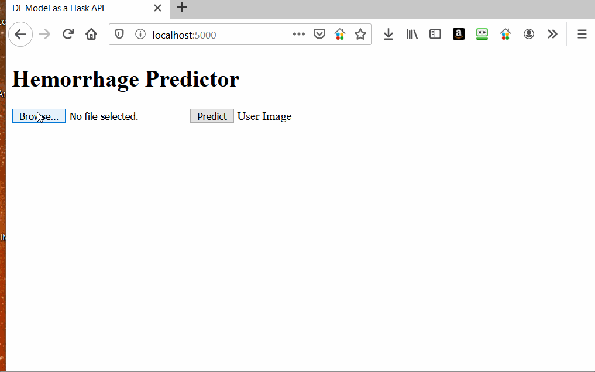

# Springboard MLE career Track

## Repo for the Capstone Project

## DL Model to Predict Intracranial Hemorrhage Detection

## Table of Contents

1. [Dependencies](#dependencies)
2. [Project Motivation](#motivation)
3. [Files Description](#description)
4. [Results](#results)
5. [Acknowledgements](#acknowledgements)

### Dependencies 

All the following libraries are needed to implement this project:

**Python** 
**Pandas** 
**Matplotlib** 
**Seaborn** 
**Flask** 
**Keras** 
**Pydicom** 

It is also highly recommended to use the Anaconda distribution of Python which has most of the data science libraries preinstalled.

### Project Motivation 

This project is an effort to utilize all the skills learned in the Springboard's Machine Learning Career Track to solve a real world problem and gain the needed experience to build a large scale AI system and deploy to production.

### Files Description 

*data_wrangling_EDA.ipynb* : Initial Exploratory analysis of the dataset  
*spring_cap_scaled.ipynb* : Notebook containing model architecture and training  
*deployment/* : Files needed to deploy the model as a Flask Application  

### Results 

### Acknowledgements 

I would like to thank Radiological Society of North America (RSNA) for the dataset and my springboard mentor Srdjan Santic for guiding me through this process.

